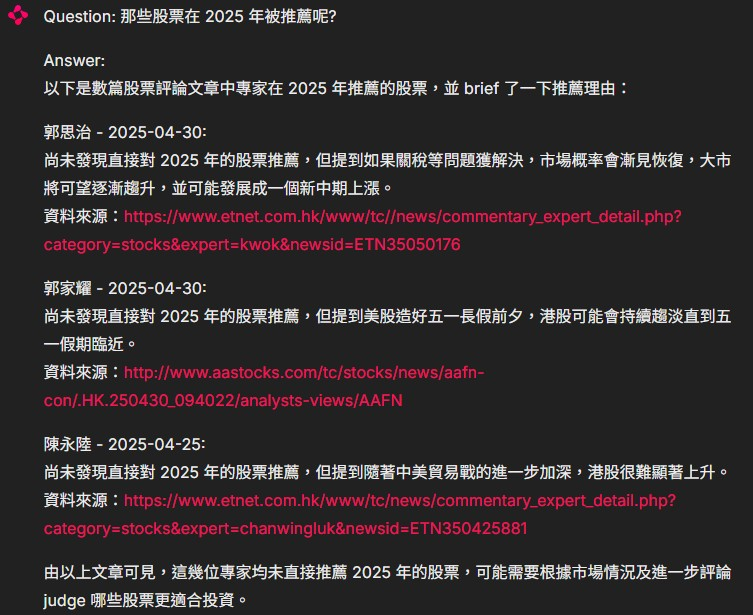
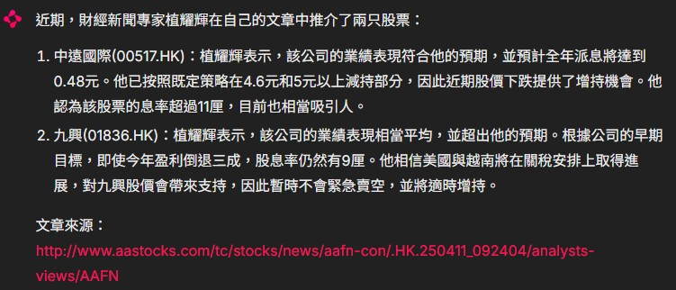

# Chainlit Chatbot 
A Chatbot which analyzes stock analysts' forecast on the stock market
<br/>
The chatbot can store stock articles found online (based on a list of pre-defined websites and stock analysts)
<br/>
You can ask the chatbot about outlook on the stock market. The chatbot will answer based on the stock articles stored.


### Copy the code
Run the following command in your local folder after logging in with your Github account:
```
git clone https://github.com/madzai/chatbot_llm.git
```

### Install required Python packages
Create and activate a virtual environment. Then run the following code in the parent folder:
```
pip install -r requirements.txt
```

### Run the code
Run the chatbot with the following code in the parent folder:
```
chainlit run app.py
```
The chatbot will be available in http://localhost:8000/


</br>
</br>
</br>

</br>
</br>

### Update the data
In order to get the most updated market information, search for newer stock articles is needed.
<br />
Use function Update_all_data() and run the code in webSearch.py to search for new stock articles and store for use.
```
python webSearch.py
```

### About the stock article data
The stock articles are stored in guru_urls.json. 
<br />
File guru_source.json defines the data source and stock analysts to search for when updating the data.
<br />


